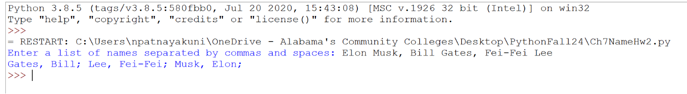

Write a program that reads a string from the user containing a list of names separated by commas and spaces. The program should then parse the string and print the names in the format "Last Name, First Name" in alphabetical order.

For example, if the user inputs the following strings, your program output should look like this. There is no video for this homework. 

