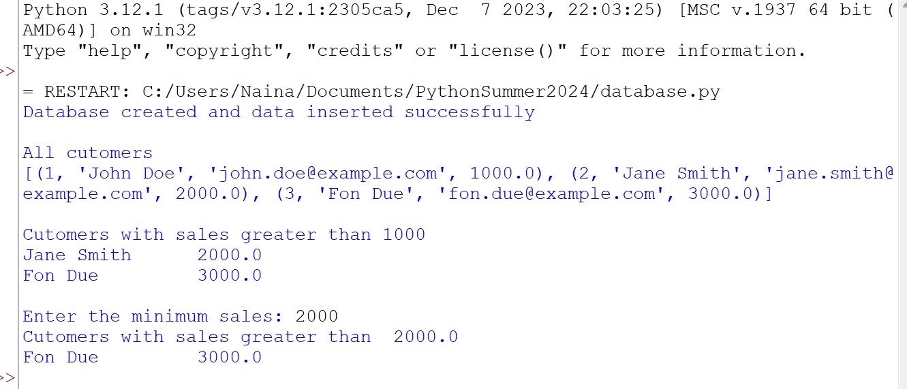

Create an SQLite database named cutomers. Add a cutomer table in the database and add  data for 3 customers, their names, email addresses and sales_amount.

The data is below:

John Doe, john.doe@example.com, 1000
Jane Smith, jane.smith@example.com, 2000
Fon Due, fon.due@example.com, 3000

Then use an SQL query in python to:

1. Select all customers and print the results of the SELECT statement as a list of tuples
2. select only those customers and sales_amount where sales_amount > 1000.
3. Ask the user to specify minimum sales and select those customers where minimum sales is greater than that amount. 

The example in the screenshot is when the user selects 2000

The output of query would be as follows 
